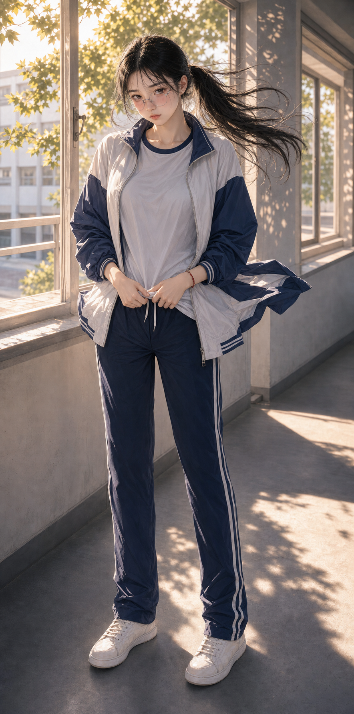
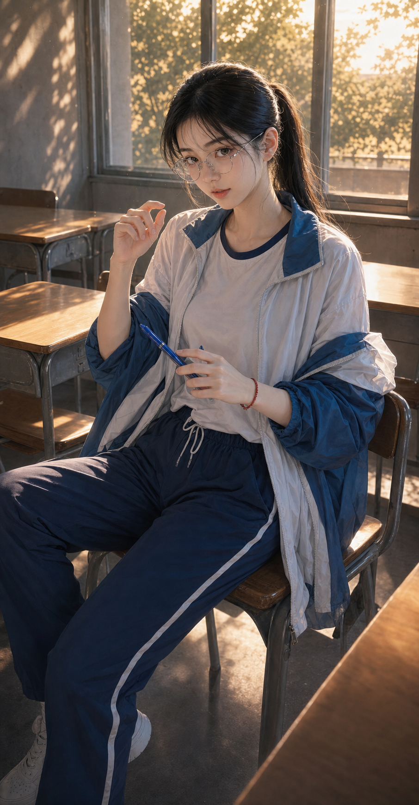
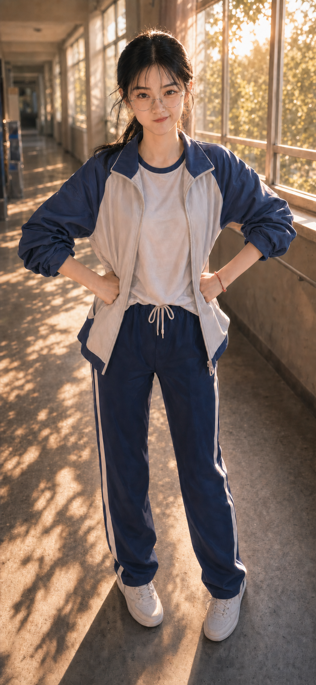
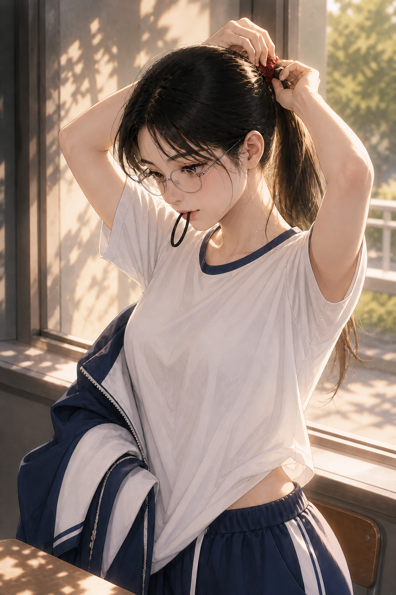
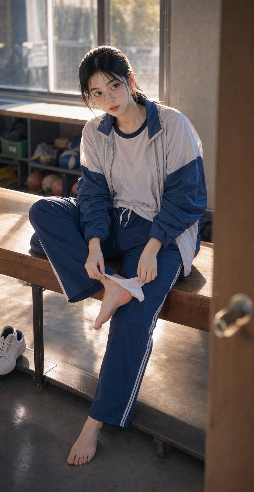
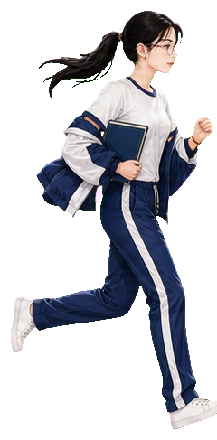
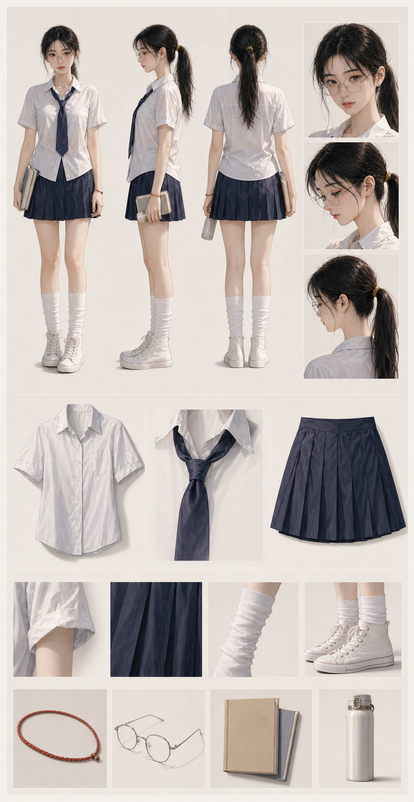
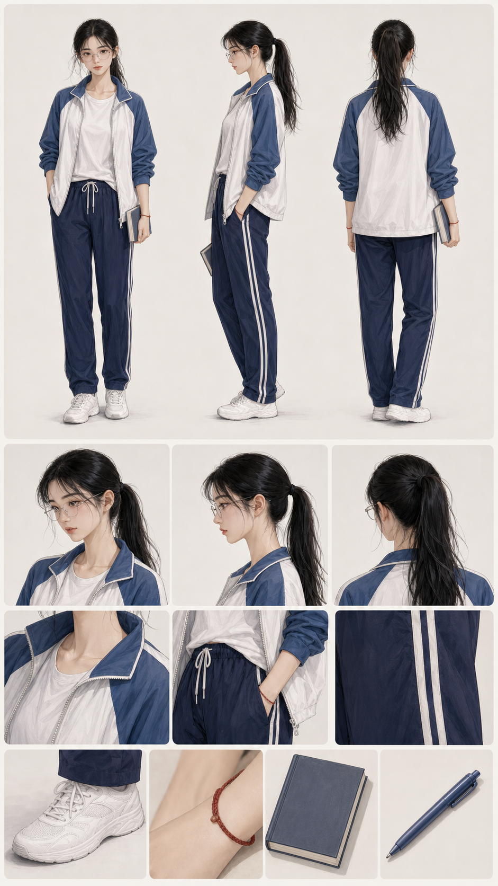
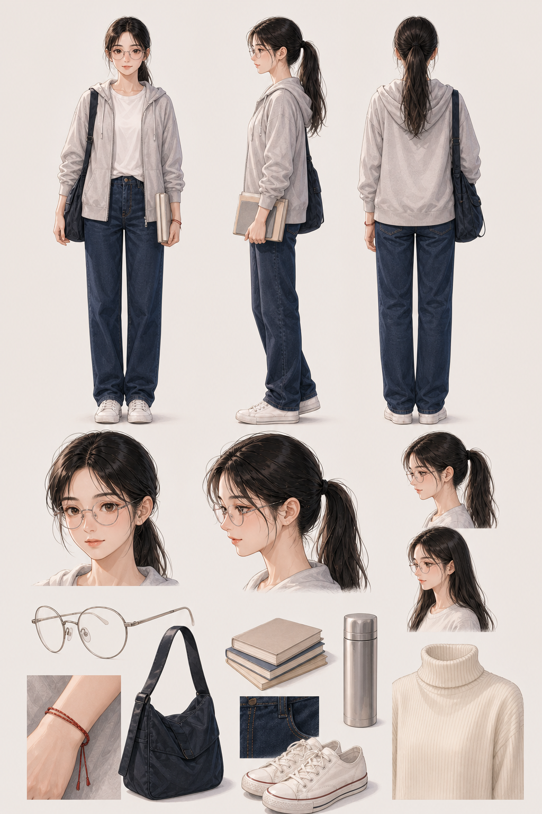

# Chinese Campus White Moon Pets

> 中国校园里的白月光形象：安静、克制，带着放学后才会被看见的细小情绪。

这是一个半写实亚洲插画风格的 Codex Pet 合集。人物以黑色高马尾、细圆框眼镜、红手绳和清爽的蓝白校园服饰作为核心识别符号，在窗边逆光、空教室与长走廊中呈现自然、不摆拍的互动感。

## 高清人物图

夏装与蓝白运动校服的高清生成图放在同一组展示；这些文件是人物生成成品，不包含用于定型的真人参考照片。

### 夏装 · 五个瞬间

| idle · 窗边等风 | waving · 擦肩回眸 |
| --- | --- |
|  |  |
| 抱着书和保温杯，在窗边安静看向你。 | 已经走过去，又回头推镜、轻笑着挥手。 |

| running · 马尾掠过夏天 | failed · 假装生气 | waiting · 欲言又止 |
| --- | --- | --- |
|  |  |  |
| 她抱着书跑过梧桐道，马尾在逆光里扬起。 | 被你捉弄后叉腰鼓脸，下一秒却自己先笑了。 | 抬手想叫住你，又把话留在黄昏里。 |

### 蓝白运动校服 · 五个瞬间

五张展示图采用蓝白运动校服版本，并从用户第一视角捕捉放学后的青涩互动。

| 迎风反应 · `jumping` | 低头转笔 · `waiting` |
| --- | --- |
|  |  |
| 这里的 `jumping` 不是跳跃：风突然吹乱马尾和外套，她双脚落地按住衣摆，脸红着对你鼓起脸。 | 笔在指间停停转转，她几次想开口，又把话留在黄昏的教室里。 |

| 假装生气 · `failed` | 拢起马尾 · `review` | 运动后 · 被发现 |
| --- | --- | --- |
|  |  |  |
| 被捉弄后正面对你叉腰鼓脸，下一秒却自己先绷不住笑。 | 她咬着发绳抬手拢起马尾，真实发丝和校服衣料落在黄昏侧光里。 | 刚跑完操，鞋跟磨得不舒服；她脱下一只短袜检查时，忽然发现你站在门口。 |

## Pet 的关键动作

### 夏装 Pet · 六个动作

夏装 Pet 的透明动作图继续完整保留，并按较小高度展示，避免低分辨率素材在 README 中被过度放大。

| idle · 安静抱书 | waving · 回眸推镜 | jumping · 大风反应 |
| --- | --- | --- |
|  |  |  |
| 抱着书，安静等待新的指令。 | 擦肩而过后回头推镜，轻轻打招呼。 | 马尾和裙褶被风吹乱，连忙整理衣摆。 |

| failed · 假装生气 | waiting · 欲言又止 | running · 专注翻书 |
| --- | --- | --- |
|  |  |  |
| 叉腰看向你，嘴角却已经快绷不住。 | 抱着书看过来，像是有话想说。 | 认真阅读和翻页，进入 Codex 工作状态。 |

### 蓝白运动校服 Pet · 六个动作

以下动作直接从蓝白运动校服 Pet 的高清生成条带中选帧，只做绿幕抠除和透明边缘整理，没有从 `192 × 208` 图集小帧放大。README 统一按较小高度展示，点击图片仍可查看高清透明 PNG。

| idle · 抱书待命 | waving · 回眸招呼 | running · 马尾摆动 |
| --- | --- | --- |
|  |  |  |
| 安静抱书，外套自然滑在臂弯。 | 正面轻轻挥手，保持克制的笑意。 | 抱着书向前跑，马尾和外套随动作扬起。 |

| failed · 假装生气 | waiting · 低头转笔 | review · 重新束发 |
| --- | --- | --- |
|  |  |  |
| 正面对你叉腰鼓脸，认真不了太久。 | 低头转着笔，像是在等你先开口。 | 咬住发绳抬手拢起马尾，准备继续检查结果。 |

## 人设分解

三套服饰沿用同一人物比例、脸部特征、眼镜、高马尾和红手绳，分别覆盖夏日校园、蓝白运动校服与放学后日常穿搭。

| 夏装 | 蓝白运动校服 | 日常服饰 |
| --- | --- | --- |
|  |  |  |
| 白衬衫、深蓝领结与百褶裙，保留夏日窗边的清爽感。 | 白 T、蓝白外套与藏蓝白杠校裤，宽松而有生活痕迹。 | 浅灰连帽外套、直筒牛仔裤与白帆布鞋，适合放学后的普通一天。 |

## 四个 Codex Pet

| 版本 | Pet ID | 特色 | 预览 |
| --- | --- | --- | --- |
| 日常基础版 | `campus-white-moon-daily` | 干净的二次元校园形象，动作轮廓清楚 | [动作表](pets/campus-white-moon-daily/contact-sheet.png) · [16 向注视](pets/campus-white-moon-daily/look-directions.png) |
| 夏装互动版 | `campus-white-moon-summer-v2` | 回头推镜、马尾摆动、读书翻页与迎风反应 | [动作表](pets/campus-white-moon-summer-v2/contact-sheet.png) · [16 向注视](pets/campus-white-moon-summer-v2/look-directions.png) |
| 夏装白月光版 | `campus-white-moon-summer-v3` | 更安静克制，突出抱书、窗边、黄昏和欲言又止 | [动作表](pets/campus-white-moon-summer-v3/contact-sheet.png) · [16 向注视](pets/campus-white-moon-summer-v3/look-directions.png) |
| 蓝白运动校服版 | `campus-white-moon-tracksuit` | 迎风压衣摆、低头转笔、鼓脸笑场与束马尾 | [动作表](pets/campus-white-moon-tracksuit/contact-sheet.png) · [16 向注视](pets/campus-white-moon-tracksuit/look-directions.png) |

全部版本均采用 Codex Pet v2 图集：

- `8 × 11` 布局，单元尺寸 `192 × 208`
- 最终尺寸 `1536 × 2288`
- RGBA WebP，透明背景
- `spriteVersionNumber: 2`
- 每个包均附带动作表、16 向注视图与脱敏后的校验报告

## 安装

选择一个 Pet ID，将对应目录复制到 Codex Pet 目录：

```bash
PET_ID=campus-white-moon-tracksuit
mkdir -p "$HOME/.codex/pets/$PET_ID"
cp "pets/$PET_ID/pet.json" "pets/$PET_ID/spritesheet.webp" "$HOME/.codex/pets/$PET_ID/"
```

四个版本使用不同 ID，可以同时安装。

## 目录

```text
gallery/actions/                       五张蓝白校服第一视角动作图
gallery/*.png                          五张夏装高清人物生成图
gallery/pet-actions-tracksuit/         六张高清透明蓝白校服 Pet 动作图
gallery/pet-actions-summer-v2/         六张透明夏装 Pet 动作图
gallery/character-sheets/              夏装、校服与日常服饰分解图
pets/campus-white-moon-daily/          日常基础版与 QA
pets/campus-white-moon-summer-v2/      夏装互动版与 QA
pets/campus-white-moon-summer-v3/      夏装白月光版与 QA
pets/campus-white-moon-tracksuit/      蓝白运动校服版与 QA
```

## 隐私与素材边界

仓库只包含最终 Pet、脱敏 QA、动作预览和生成插画，不包含真人参考照片、私人档案、人设 YAML、提示词、生成中间文件或本机绝对路径。人物与仓库均使用通用化名称。

## License

仓库未附加开源许可。图片与角色素材仅用于个人 Codex Pet 展示和使用。
